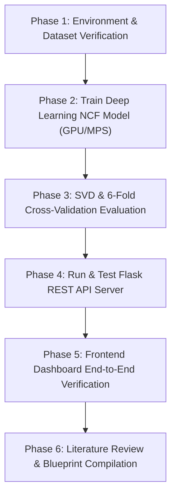

# AGENTS.md — SmartRecSys Project Instructions & Actionable Execution Plan

> **Project Title**: *SmartRecSys: An Intelligent Hybrid Recommendation System for Personalized E-Learning in Smart Campus Environments Addressing the Cold-Start Problem and Data Sparsity*  
> **Academic Level**: 4th-Year Engineering Major Project  
> **Current Working Branch**: `feat/model-training-and-agent-plan`

---

## 🎯 1. Project Mission & Objectives

**SmartRecSys** is an academic course recommendation platform built for university smart campuses. It addresses three critical challenges in educational data mining:
1. **Cold-Start Problem**: Recommending relevant courses to new students with zero prior history via semantic content vectorization (TF-IDF + Cosine Similarity).
2. **Matrix Sparsity**: Alleviating sparse campus enrollment matrices through weighted hybrid fusion and deep latent factor modeling.
3. **Context-Aware Explainability (XAI)**: Generating transparent recommendation reasoning (*"Why recommended"*) tailored to a student's department, semester, completed prerequisites, difficulty level, and career aspirations.

---

## 👥 2. Team Member Roles & Agent Responsibilities

| Role | Lead | Focus Area | Key Deliverables |
|---|---|---|---|
| **Member 1** | **Project Lead & Core Backend** | Architecture, Data Pipeline, EDA | `dataset/`, `eda.py`, `plots/`, Git workflows |
| **Member 2** | **Frontend UI/UX Engineer** | Web Dashboard, Profile Intake, Cards | `welcome.html`, `home.html`, `dashboard.html`, `about.html`, `docs.html`, `style.css`, `app.js` |
| **Member 3** | **Literature Lead & System Architect** | 20 Reference Papers Synthesis, Algorithmic Blueprint, Thesis | `docs/literature_review.md`, `docs/algorithmic_blueprint.md`, Thesis Report |
| **Member 4** | **ML / DL Model Engineer** | Neural Collaborative Filtering (NCF), SVD Matrix Factorization, Cross-Validation | `recommender.py`, `dl_recommender_gpu.py`, `evaluate_ml.py`, `models/ncf_recommender.pth` |

---

## 📚 3. Literature & Theoretical Foundation

The project is grounded in **20 international peer-reviewed papers** located in [`Reference Paper/`](file:///Users/jayantshoundik/Desktop/Major%20Project/Reference%20Paper):

1. **Primary Reference Paper**:
   * *An Intelligent Hybrid Recommendation System for E-Learning Personalization in Smart Campus* — Manar Joundy Hazar (2025).
   * **Formula**: $\text{Score}_{\text{hybrid}} = \alpha \cdot \text{Score}_{\text{content}} + (1 - \alpha) \cdot \text{Score}_{\text{collaborative}}$ ($\alpha = 0.5$).
2. **IEEE Folder (10 Papers)**:
   * Covers Neural Collaborative Filtering, Federated Recommendation, Bias Distillation, Intent-Aware Context, Retraining Graph Convolutions, and Matthew Effect / Sparsity Analysis.
3. **Elsevier Folder (10 Papers)**:
   * Covers Deep Latent Factor Models, Post-Hoc Explainability (XAI), Graph-Based Hybrid Recommendations (GHRS), Multi-Stakeholder Evaluation, and Assistive Personalization for Diverse Learners.

---

## 📋 4. Actionable Execution Plan (Phase-by-Phase)



### Phase 1: Environment & Dataset Verification ✅
* **Objective**: Ensure dataset presence and library dependencies are satisfied.
* **Commands**:
  ```bash
  python3 -c "import torch, sklearn, pandas, numpy, matplotlib, seaborn, flask, flask_cors; print('✅ All dependencies installed')"
  python3 eda.py
  ```
* **Expected Output**: Dataset `dataset/udemy_courses.csv` loaded; charts generated in `plots/`.

---

### Phase 2: PyTorch Deep Learning Models Training (NCF & Large-Scale NeuMF) ⏳
* **Objective**: Train the Deep Learning models (Base NCF and Large-Scale NeuMF) with GPU/MPS acceleration.

* **Option A: Base NCF Training (1,000 users)**:
  ```bash
  python3 dl_recommender_gpu.py
  ```
  *Output:* `models/ncf_recommender.pth`

* **Option B: Large-Scale NeuMF Training (25,000+ students, High-Accuracy Benchmark)**:
  ```bash
  # Step 1: Synthesize 25,000 students across realistic curriculum tracks (~250,000 interactions)
  python3 generate_large_scale_interactions.py

  # Step 2: Train NeuMF (GMF + MLP) and run Leave-One-Out Evaluation (HR@5, HR@10, NDCG@10, MRR)
  python3 train_neumf_large.py
  ```
  *Output:* `models/neumf_large.pth`, `plots/large_scale_evaluation.png`

---

### Phase 3: Machine Learning & 6-Fold Cross-Validation Evaluation ⏳
* **Objective**: Run 6-fold cross-validation comparing Content-Based, Item-Item Collaborative, Weighted Hybrid, and SVD Matrix Factorization.
* **Metrics**: Precision@3, Recall@3, Precision@5, Recall@5.
* **Script**: `evaluate_ml.py`
* **Execution Command**:
  ```bash
  python3 evaluate_ml.py
  ```
* **Verification**: Verify that `plots/evaluation_comparison.png` is generated with updated benchmark metrics.

---

### Phase 4: Backend REST API Server Verification ⏳
* **Objective**: Launch the Flask API server serving recommendation scoring, filters, and dynamic explanations.
* **Script**: `server.py` (running on `http://127.0.0.1:5001`)
* **Execution Command**:
  ```bash
  python3 server.py
  ```
* **Health Check**:
  ```bash
  curl http://127.0.0.1:5001/status
  ```
* **Test Recommendation Endpoint**:
  ```bash
  curl -X POST http://127.0.0.1:5001/recommend \
    -H "Content-Type: application/json" \
    -d '{"user_id": 42, "preferences": {"domains": ["Web Development"], "difficulty": "Beginner", "dept": "Computer Science"}}'
  ```

---

### Phase 5: Frontend Dashboard UI Verification ⏳
* **Objective**: Verify end-to-end user experience across all 5 pages.
* **Local Server Command**:
  ```bash
  python3 -m http.server 8000
  ```
* **User Journey**:
  1. Open `http://localhost:8000/welcome.html` → Click **Get Started**.
  2. Complete Academic Profile on `home.html` (Name, Department, Domains, Difficulty) → Submit.
  3. Inspect `dashboard.html`:
     * Verify student profile chips.
     * Verify top-3 featured match cards.
     * Verify match percentage ring indicators (`0-100%`).
     * Verify dynamic domain/difficulty filtering.
     * Verify *"Why recommended"* pedagogical justifications.

---

### Phase 6: Literature Synthesis & Algorithmic Blueprint Dossier ⏳
* **Objective**: Compile centralized literature review and algorithmic math blueprint.
* **Outputs**:
  * `docs/literature_review.md` (Deep analysis of all 20 reference papers).
  * `docs/algorithmic_blueprint.md` (Mathematical formulation of TF-IDF, Cosine Sim, SVD, and NCF).

---

## 🛠️ 5. Technical Specifications & Architecture

### Backend API Contract (`POST /recommend`)
* **Request Payload**:
  ```json
  {
    "user_id": "Student Name or Integer ID",
    "preferences": {
      "domains": ["Web Development", "Data Science"],
      "difficulty": "Beginner",
      "dept": "Computer Science"
    }
  }
  ```
* **Response Payload (Array of Course Objects)**:
  ```json
  [
    {
      "rank": 1,
      "title": "Learn HTML5 Programming From Scratch",
      "domain": "Web Development",
      "difficulty": "Beginner",
      "score": 0.94,
      "duration": "6 Weeks",
      "description": "Master the essentials of HTML5...",
      "skills": ["Web Development", "Frontend"],
      "reason": "Recommended based on your interest in Web Development at a Beginner level."
    }
  ]
  ```

---

## 💻 6. Operational Guidelines for Collaborating Agents

1. **Seed Reproducibility**: Always enforce `random_seed = 42` across NumPy, PyTorch, and scikit-learn scripts.
2. **Hardware Acceleration**: Always use `torch.device("mps")` on macOS / `torch.device("cuda")` on Windows/Linux with automatic fallback to CPU.
3. **Port Alignment**: Keep backend port configured to `5001` across `server.py`, `app.js`, and `app_api.js`.
4. **Git Hygiene**: Commit logical feature increments with clear semantic commit messages (`feat:`, `fix:`, `docs:`, `perf:`).
