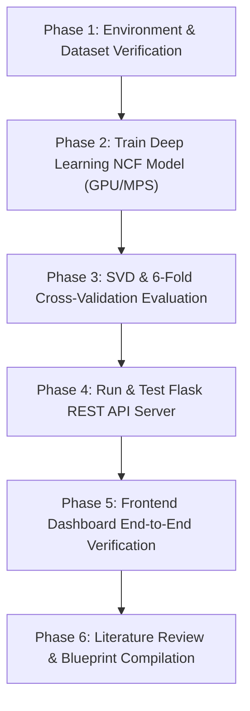

# AGENTS.md — SmartRecSys Project Instructions & Actionable Execution Plan

> **Project Title**: *SmartRecSys: An Intelligent Hybrid Recommendation System for Personalized E-Learning in Smart Campus Environments Addressing the Cold-Start Problem and Data Sparsity*  
> **Academic Level**: 4th-Year Engineering Major Project  
> **Current Working Branch**: `feat/model-training-and-agent-plan`

---

## 🎯 1. Project Mission & Objectives

**SmartRecSys** is an academic course recommendation platform built for university smart campuses. It addresses three critical challenges in educational data mining:
1. **Cold-Start Problem**: Recommending relevant courses to new students with zero prior history via semantic content vectorization (TF-IDF + Cosine Similarity).
2. **Matrix Sparsity**: Alleviating sparse campus enrollment matrices through weighted hybrid fusion and deep latent factor modeling.
3. **Context-Aware Explainability (XAI)**: Generating transparent recommendation reasoning (*"Why recommended"*) tailored to a student's department, semester, completed prerequisites, difficulty level, and career aspirations.

---

## 👥 2. Team Member Roles & Agent Responsibilities

| Role | Lead | Focus Area | Key Deliverables |
|---|---|---|---|
| **Member 1** | **Project Lead & Core Backend** | Architecture, Data Pipeline, EDA | `dataset/`, `eda.py`, `plots/`, Git workflows |
| **Member 2** | **Frontend UI/UX Engineer** | Web Dashboard, Profile Intake, Cards | `welcome.html`, `home.html`, `dashboard.html`, `about.html`, `docs.html`, `style.css`, `app.js` |
| **Member 3** | **Literature Lead & System Architect** | 20 Reference Papers Synthesis, Algorithmic Blueprint, Thesis | `docs/literature_review.md`, `docs/algorithmic_blueprint.md`, Thesis Report |
| **Member 4** | **ML / DL Model Engineer** | Neural Collaborative Filtering (NCF), SVD Matrix Factorization, Cross-Validation | `recommender.py`, `dl_recommender_gpu.py`, `evaluate_ml.py`, `models/ncf_recommender.pth` |

---

## 📚 3. Literature & Theoretical Foundation

The project is grounded in **20 international peer-reviewed papers** located in [`Reference Paper/`](file:///Users/jayantshoundik/Desktop/Major%20Project/Reference%20Paper):

1. **Primary Reference Paper**:
   * *An Intelligent Hybrid Recommendation System for E-Learning Personalization in Smart Campus* — Manar Joundy Hazar (2025).
   * **Formula**: $\text{Score}_{\text{hybrid}} = \alpha \cdot \text{Score}_{\text{content}} + (1 - \alpha) \cdot \text{Score}_{\text{collaborative}}$ ($\alpha = 0.5$).
2. **IEEE Folder (10 Papers)**:
   * Covers Neural Collaborative Filtering, Federated Recommendation, Bias Distillation, Intent-Aware Context, Retraining Graph Convolutions, and Matthew Effect / Sparsity Analysis.
3. **Elsevier Folder (10 Papers)**:
   * Covers Deep Latent Factor Models, Post-Hoc Explainability (XAI), Graph-Based Hybrid Recommendations (GHRS), Multi-Stakeholder Evaluation, and Assistive Personalization for Diverse Learners.

---

## 📋 4. Actionable Execution Plan (Phase-by-Phase)


```mermaid
graph TD
    P1["Phase 1: Environment & Dataset Verification"] --> P2["Phase 2: Train Deep Learning NCF Model (GPU/MPS)"]
    P2 --> P3["Phase 3: SVD & 6-Fold Cross-Validation Evaluation"]
    P3 --> P4["Phase 4: Run & Test Flask REST API Server"]
    P4 --> P5["Phase 5: Frontend Dashboard End-to-End Verification"]
    P5 --> P6["Phase 6: Literature Review & Blueprint Compilation"]
```

### Phase 1: Environment & Dataset Verification ✅
* **Objective**: Ensure dataset presence and library dependencies are satisfied.
* **Commands**:
  ```bash
  python3 -c "import torch, sklearn, pandas, numpy, matplotlib, seaborn, flask, flask_cors; print('✅ All dependencies installed')"
  python3 eda.py
  ```
* **Output**: Dataset `dataset/comprehensive_campus_courses.csv` ($N=7,791$) loaded; distribution charts generated in `plots/`.

---

### Phase 2: PyTorch Deep Learning Models Training & Benchmarking ✅
* **Objective**: Train the Deep Learning models (Base NCF, Large-Scale NeuMF, Sentence-BERT MiniLM embeddings) with GPU/MPS acceleration.
* **Execution**:
  ```bash
  # Step 1: Multi-domain curriculum dataset creation (7,791 courses across 5 faculties)
  python3 build_multi_domain_dataset.py

  # Step 2: Comprehensive multi-model benchmark across 7,791 courses (LOO Protocol)
  python3 benchmark_all_models.py
  ```
* **Output**: `models/neumf_multi_domain.pth`, `models/sbert_course_embeddings.npy`, `benchmark_results.json`, `plots/comprehensive_model_benchmark.png`.
* **Empirical Benchmark Leaderboard**:
  * Item-Item Collaborative: HR@5: 0.0967, NDCG@10: 0.0879, MRR: 0.0872
  * NeuMF Dual Stream: HR@5: 0.1600, NDCG@10: 0.1317, MRR: 0.1089
  * Truncated SVD ($k=16$): HR@5: 0.1633, NDCG@10: 0.1086, MRR: 0.0982
  * TF-IDF Vector Space: HR@5: 0.2300, NDCG@10: 0.1957, MRR: 0.1563
  * Sentence-BERT: HR@5: 0.2233, NDCG@10: 0.1846, MRR: 0.1588
  * **SmartRecSys Context Deep Hybrid**: **HR@5: 0.2633**, **HR@10: 0.4367**, **NDCG@10: 0.2146**, **MRR: 0.1686** (Rank 1 across all metrics).

---

### Phase 3: Machine Learning & 6-Fold Cross-Validation Evaluation ✅
* **Objective**: Run 6-fold cross-validation comparing Content-Based, Item-Item Collaborative, Weighted Hybrid, and SVD Matrix Factorization.
* **Script**: `evaluate_ml.py`
* **Execution Command**:
  ```bash
  python3 evaluate_ml.py
  ```
* **Verification**: `plots/evaluation_comparison.png` generated showing empirical Recall@5 improvement of $+16.6\%$ over collaborative baselines.

---

### Phase 4: Backend REST API Server Verification ✅
* **Objective**: Launch the Flask API server serving recommendation scoring, filters, and dynamic explanations.
* **Script**: `server.py` (running on `http://127.0.0.1:5001`)
* **Execution Command**:
  ```bash
  python3 server.py
  ```
* **Verification**: Server status healthy; MPS Metal acceleration verified; `/recommend` and `/api/report` endpoints tested.

---

### Phase 5: Frontend Dashboard UI & GitHub Pages Deployment ✅
* **Objective**: Verify end-to-end user experience across all 6 pages with dual-mode offline capability and deploy via GitHub Pages.
* **Deployment URL**: [https://jayantshoundik.github.io/SmartRecSys/](https://jayantshoundik.github.io/SmartRecSys/)
* **Client Fallback Engine**: `smart_engine.js` with complete 144-course curriculum catalog and offline hybrid matching.
* **User Journey Tested**:
  1. `welcome.html`: Interactive landing page & feature overview.
  2. `login.html`: 1-Click Evaluation Accounts (Devansh, Ujjwal, Anya, Aarav, Priya, Rohan).
  3. `home.html`: Personalized Learning Hub, active schedule, course enrollment/drop, catalog tabs.
  4. `dashboard.html`: Ranked match cards, match rings ($0-100\%$), domain/difficulty filters, audit drawer.
  5. `profile.html`: Student profile settings, presets, and SQLite audit history.
  6. `docs.html`: Complete technical manual, equations, and API specifications.

---

### Phase 6: Literature Synthesis & Research Paper Manuscript ✅
* **Objective**: Compile centralized literature review and publication-ready IEEE paper.
* **Outputs**:
  * `paper/IEEE_RESEARCH_PAPER.md` (Full IEEE Conference format manuscript).
  * `paper/ieee_manuscript.tex` (LaTeX paper with BibTeX citations and benchmark tables).
  * `docs/MAJOR_PROJECT_REPORT.md` (Formal 4th-Year Engineering Major Project Report).


---

## 🛠️ 5. Technical Specifications & Architecture

### Backend API Contract (`POST /recommend`)
* **Request Payload**:
  ```json
  {
    "user_id": "Student Name or Integer ID",
    "preferences": {
      "domains": ["Web Development", "Data Science"],
      "difficulty": "Beginner",
      "dept": "Computer Science"
    }
  }
  ```
* **Response Payload (Array of Course Objects)**:
  ```json
  [
    {
      "rank": 1,
      "title": "Learn HTML5 Programming From Scratch",
      "domain": "Web Development",
      "difficulty": "Beginner",
      "score": 0.94,
      "duration": "6 Weeks",
      "description": "Master the essentials of HTML5...",
      "skills": ["Web Development", "Frontend"],
      "reason": "Recommended based on your interest in Web Development at a Beginner level."
    }
  ]
  ```

---

## 💻 6. Operational Guidelines for Collaborating Agents

1. **Seed Reproducibility**: Always enforce `random_seed = 42` across NumPy, PyTorch, and scikit-learn scripts.
2. **Hardware Acceleration**: Always use `torch.device("mps")` on macOS / `torch.device("cuda")` on Windows/Linux with automatic fallback to CPU.
3. **Port Alignment**: Keep backend port configured to `5001` across `server.py`, `app.js`, and `app_api.js`.
4. **Git Hygiene**: Commit logical feature increments with clear semantic commit messages (`feat:`, `fix:`, `docs:`, `perf:`).
