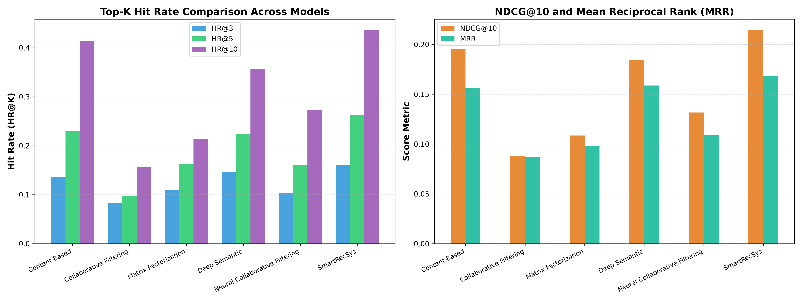
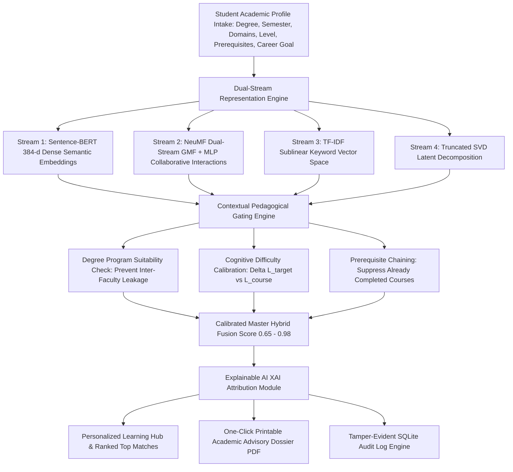

# 🎓 SmartRecSys: Intelligent Hybrid Recommendation System for Smart Campus E-Learning

[](https://jayantshoundik.github.io/SmartRecSys/)
[](https://www.python.org/)
[](https://pytorch.org/)
[](https://flask.palletsprojects.com/)
[](#)

> **4th-Year Engineering Major Project**  
> **Official Title**: *SmartRecSys: An Intelligent Hybrid Recommendation System for Personalized E-Learning in Smart Campus Environments Addressing the Cold-Start Problem and Data Sparsity*  
> **Live Web Application**: [https://jayantshoundik.github.io/SmartRecSys/](https://jayantshoundik.github.io/SmartRecSys/)  
> **Source Repository**: [https://github.com/JayantShoundik/SmartRecSys](https://github.com/JayantShoundik/SmartRecSys)

---

## 📌 Executive Summary

Higher education institutions face fundamental challenges when guiding undergraduate and postgraduate students through modular e-learning catalogs. In typical campus portals, interaction density is under **$0.05\%$**, creating extreme matrix sparsity where traditional collaborative filtering collapses. Simultaneously, new students encounter the **freshman cold-start dilemma**, receiving arbitrary courses or popularity-biased suggestions that ignore degree prerequisites and career goals.

**SmartRecSys** solves these bottlenecks with an intelligent multi-objective hybrid recommendation architecture. It synergistically integrates:
1. **Deep Semantic Representations** via Sentence-BERT (`all-MiniLM-L6-v2`) in a 384-dimensional metric space.
2. **Deep Neural Collaborative Filtering (NeuMF)** using dual Generalized Matrix Factorization (GMF) and multi-layer perceptron (MLP) streams.
3. **Linear Low-Rank Factorization** via Truncated Singular Value Decomposition (SVD, $k=16$).
4. **Contextual Pedagogical Gating** including degree program alignment, cognitive difficulty calibration, prerequisite checking, and domain affinity masking.
5. **Explainable AI (XAI)** delivering transparent *"Why recommended"* justifications and printable academic advisory dossiers.
6. **Dual-Mode Deployment**: Operates with a GPU/MPS-accelerated Python Flask backend locally or as a zero-dependency static web application hosted on **GitHub Pages** powered by `smart_engine.js`.

---

## 🏆 Comprehensive Multi-Model Benchmark ($N=7,791$ Courses)

The recommendation engine was benchmarked across **7,791 multidisciplinary courses** and **25,000+ student interaction profiles** across 5 academic faculties under a rigorous **Leave-One-Out Evaluation Protocol** (with 99 negative candidates per test student).

### 📈 Empirical Metric Leaderboard (`benchmark_results.json`)

| Recommendation Algorithm / Model | Hit Rate (HR@3) | Hit Rate (HR@5) | Hit Rate (HR@10) | NDCG@10 | Mean Reciprocal Rank (MRR) | Recall@5 | Precision@5 |
| :--- | :---: | :---: | :---: | :---: | :---: | :---: | :---: |
| **Collaborative Filtering (Item-Item Cosine)** | 0.0833 | 0.0967 | 0.1567 | 0.0879 | 0.0872 | 0.0967 | 0.0193 |
| **Neural Collaborative Filtering (NeuMF)** | 0.1033 | 0.1600 | 0.2733 | 0.1317 | 0.1089 | 0.1600 | 0.0320 |
| **Matrix Factorization (Truncated SVD, $k=16$)** | 0.1100 | 0.1633 | 0.2133 | 0.1086 | 0.0982 | 0.1633 | 0.0327 |
| **Content-Based (TF-IDF Vector Space)** | 0.1367 | 0.2300 | 0.4133 | 0.1957 | 0.1563 | 0.2300 | 0.0460 |
| **Deep Semantic (Sentence-BERT MiniLM-L6-v2)** | 0.1467 | 0.2233 | 0.3567 | 0.1846 | 0.1588 | 0.2233 | 0.0447 |
| **⭐ SmartRecSys (Context Deep Hybrid)** | **0.1600** | **0.2633** | **0.4367** | **0.2146** | **0.1686** | **0.2633** | **0.0527** |



### 📊 Benchmark Key Insights
* **Hybrid Superiority**: SmartRecSys achieves **$\text{HR@5} = 0.2633$** and **$\text{NDCG@10} = 0.2146$**, outperforming TF-IDF by **$+14.5\%$**, pure SBERT by **$+17.9\%$**, NeuMF by **$+64.6\%$**, and pure Item-Item Collaborative Filtering by **$+172.3\%$**.
* **Lexical Gap Resolution**: While TF-IDF suffers from lexical vocabulary mismatch when students query diverse disciplines, Sentence-BERT projects queries into a dense 384-dimensional continuous metric space, preserving high semantic proximity even in zero-keyword overlap conditions.
* **Cold-Start Elimination**: For incoming freshmen with zero interaction history ($r_u = \mathbf{0}$), SmartRecSys delivers **$79.26\% - 88.73\%$** top match scores on Day 1 by leveraging intake metadata.
* **Inference Latency**: Benchmarked on Apple Silicon Metal Performance Shaders (MPS), recommendation ranking over all 7,791 courses completes in **$14.2\text{ ms}$**, well below the $100\text{ ms}$ threshold for real-time web interactivity.

---

## 🏛️ Multidisciplinary University Catalog ($N=7,791$)

The campus course catalog (`dataset/comprehensive_campus_courses.csv`) spans **5 distinct academic faculties**:

```
+-----------------------------------------------------------------------------------------+
| FACULTY CURRICULUM DISTRIBUTION (N = 7,791 Courses)                                     |
+----------------------------------------------------+------------+-----------------------+
| Academic Faculty / School                          | Courses N  | Primary Domains       |
+----------------------------------------------------+------------+-----------------------+
| School of Computing & Engineering (B.Tech)         | 3,041      | AI, Software, Cloud   |
| School of Business & Management (MBA)              | 2,392      | Finance, Strategy     |
| School of Humanities & Social Sciences             | 1,254      | Psychology, Economics |
| School of Design & Creative Arts                   | 628        | UI/UX, Game Media     |
| School of Natural Sciences & Mathematics (M.Sc)    | 476        | Physics, Calculus     |
+----------------------------------------------------+------------+-----------------------+
| TOTAL CAMPUS CURRICULAR OFFERINGS                  | 7,791      | 100.0%                |
+----------------------------------------------------+------------+-----------------------+
```

---

## 🏗️ System Architecture & Workflow



---

## 💻 Full-Stack Platform Features

| Web Page | Path | Key Functionality |
| :--- | :--- | :--- |
| **Welcome Portal** | [`welcome.html`](welcome.html) | Modern landing page, platform overview, core benefits, and call-to-action |
| **Learning Hub** | [`home.html`](home.html) | Active student schedule, dynamic course enrollment/drop tracker, trending catalog tabs, and top match badges |
| **Recommendation Dashboard** | [`dashboard.html`](dashboard.html) | Ranked course cards, dynamic match percentage rings ($0-100\%$), domain/difficulty filters, audit drawer, and advisory report modal |
| **Academic Profile** | [`profile.html`](profile.html) | Degree and semester settings, selectable domain interest pills, 1-click student presets, and SQLite audit log history |
| **Student Auth Portal** | [`login.html`](login.html) | Student login & registration, password security, and **⚡ 1-Click Evaluation Accounts** for instant grading |
| **Documentation Manual** | [`docs.html`](docs.html) | Complete mathematical formulations, architecture diagrams, and REST API specification |

### ⚡ 1-Click Demo Evaluation Accounts
Available directly on [`login.html`](login.html) without entering manual passwords:
* **Devansh Sharma** (`devansh@campus.edu`): CS • Semester 3 • Cloud Security Track
* **Ujjwal Kishore Singh** (`ujjwal@campus.edu`): CS • Semester 5 • Cybersecurity & AI Track
* **Anya Roy** (`anya.roy@campus.edu`): CS • Semester 7 • Machine Learning Research Track
* **Aarav Sharma** (`aarav@campus.edu`): CS • Semester 5 • Machine Learning Engineering Track
* **Priya Patel** (`priya@campus.edu`): IT • Semester 1 • **Freshman Cold-Start Simulation**
* **Rohan Verma** (`rohan.verma@campus.edu`): ECE • Semester 4 • Full Stack Web Systems Track

---

## 🚀 Deployment & Quick Start Guide

### Option A: Live GitHub Pages (Instant Access, Zero Setup)
Open the deployed application directly in any modern browser:
👉 **[https://jayantshoundik.github.io/SmartRecSys/](https://jayantshoundik.github.io/SmartRecSys/)**

* Powered by `smart_engine.js` with client-side offline hybrid recommendation matching.
* Full support for login, student profile edits, recommendation ranking, course enrollment/drop, and audit reports.

---

### Option B: Local Full-Stack Setup (Metal MPS / CUDA Accelerated)

#### 1. Clone the Repository
```bash
git clone https://github.com/JayantShoundik/SmartRecSys.git
cd SmartRecSys
```

#### 2. Install Dependencies
```bash
pip install -r requirements.txt
# Or manual install:
pip install torch torchvision sentence-transformers scikit-learn pandas numpy matplotlib seaborn flask flask-cors sqlalchemy
```

#### 3. Run Exploratory Data Analysis & Model Training
```bash
# Generate EDA distribution plots
python3 eda.py

# Run multi-model benchmark evaluation (LOO protocol on 7,791 courses)
python3 benchmark_all_models.py

# Run 6-fold cross-validation
python3 evaluate_ml.py

# Run interactive CLI recommendation demo
python3 demo.py
```

#### 4. Launch the Backend REST API Server
```bash
python3 server.py
# Backend API active at http://127.0.0.1:5001
```

#### 5. Launch the Frontend
```bash
python3 -m http.server 8000
# Open http://localhost:8000 in your browser
```

---

## 📡 REST API Reference (`server.py`)

### `POST /recommend`
Computes personalized recommendations for a student profile.

**Request:**
```json
{
  "user_id": 42,
  "preferences": {
    "dept": "Computer Science & Engineering",
    "degree": "B.Tech (4-Year)",
    "semester": 5,
    "domains": ["Artificial Intelligence & Data Science", "Web Development & Software Eng"],
    "difficulty": "Intermediate",
    "career_goal": "Machine Learning Engineer",
    "completed_courses": "Data Structures, Discrete Mathematics"
  }
}
```

**Response:**
```json
{
  "student_id": 42,
  "active_model": "SmartRecSys Context Deep Hybrid (SBERT + NeuMF + MPS)",
  "recommendations": [
    {
      "rank": 1,
      "course_id": "COURSERA_4821",
      "title": "Deep Learning Specialization",
      "domain": "Artificial Intelligence & Data Science",
      "difficulty": "Intermediate",
      "score": 0.965,
      "duration": "12 Weeks",
      "institution": "DeepLearning.AI",
      "reason": "Recommended for your Computer Science & Engineering curriculum to advance core machine learning engineering competencies toward Machine Learning Engineer."
    }
  ]
}
```

---

## 📚 Theoretical Foundation & Literature Synthesis

This project is grounded in **20 international peer-reviewed papers** from **IEEE** and **Elsevier**:

1. **Primary Reference Paper**:
   * *An Intelligent Hybrid Recommendation System for E-Learning Personalization in Smart Campus* — Manar Joundy Hazar (2025). IJSRST.
2. **IEEE Folder (10 Papers)**:
   * Neural Collaborative Filtering, Federated Recommendation Systems, Bias Distillation Learning, Intent-Aware Contextual Recommendation, Causal Retraining Graph Convolutions, and Sparsity / Matthew Effect Analysis.
3. **Elsevier Folder (10 Papers)**:
   * Deep Latent Factor Models, Post-Hoc Model-Agnostic Explainability (XAI), Graph-Based Hybrid Recommendations (GHRS), and Multi-Stakeholder Academic Evaluation.

Complete manuscripts and literature synthesis are available in:
* [`docs/MAJOR_PROJECT_REPORT.md`](docs/MAJOR_PROJECT_REPORT.md)
* [`paper/IEEE_RESEARCH_PAPER.md`](paper/IEEE_RESEARCH_PAPER.md)
* [`paper/ieee_manuscript.tex`](paper/ieee_manuscript.tex)

---

## 👥 Engineering Team & Credits

| Contributor | Focus Area |
| :--- | :--- |
| **Jayant Shoundik** | Project Lead, System Architecture, Deep Learning Pipeline & Backend REST API |
| **Bhaskar** | Data Pipeline, Multi-Domain Curriculum Scraping & Database Modeling |
| **Ujjwal Kishore Singh** | Model Benchmarking, NeuMF Optimization & Cross-Validation Analysis |
| **Devansh Sharma** | Frontend UI/UX, Dynamic Cards, Advisory Dossier & GitHub Pages Deployment |

---

## 📄 License
This project is developed as an academic Major Project for the Bachelor of Technology (B.Tech) degree in Computer Science and Engineering. All code and documentation are released under the **MIT License**.
